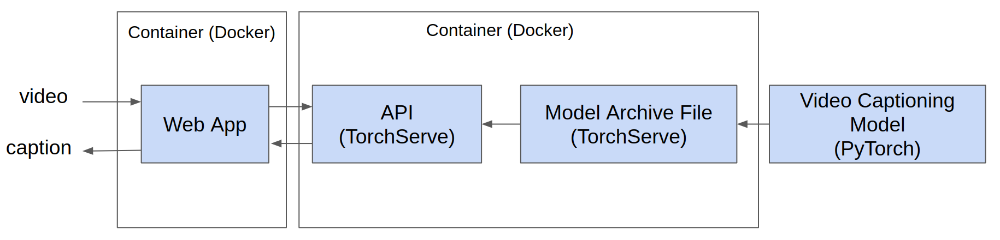
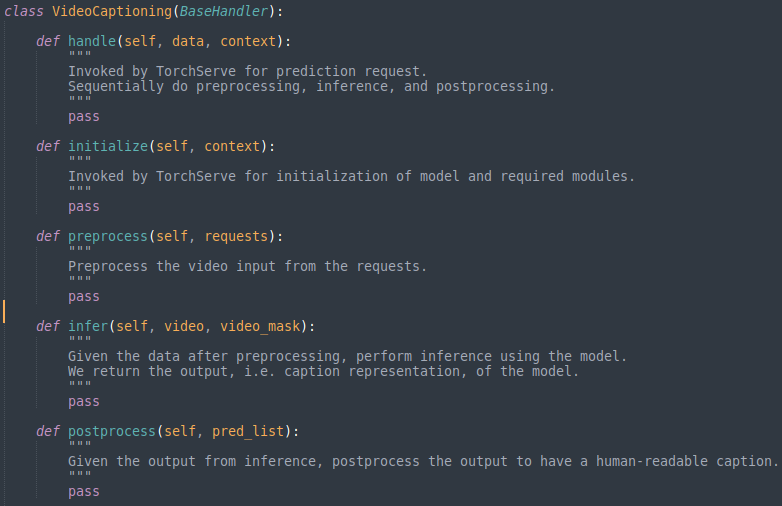
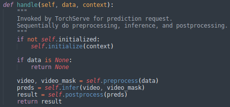
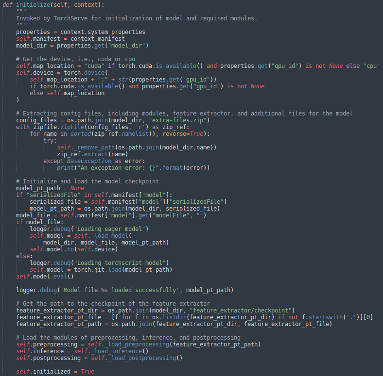
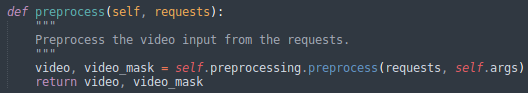
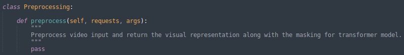
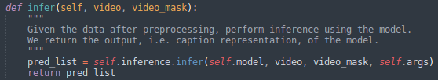
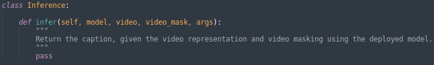
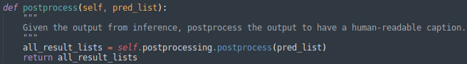
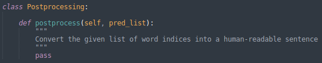

I developed this web application which able to generate a caption given a video input, which is known as video captioning. The backend API is developed with the aid of [TorchServe](https://pytorch.org/serve/), while the frontend web application is developed by utilizing [Bootstrap V5](https://getbootstrap.com/docs/5.0/getting-started/introduction/).

#### The overall system architecture is illustrated as below:
 
>
 
#### The final web application is look like below:
 
<video src='https://github.com/willyfh/video-captioning-web-app/blob/main/assets/videos/demo-video.mp4?raw=true' ></video>

## Building the Backend API
As the backend API is built by utilizing TorchServe, the provided endpoints also depend on the library. Here, i utilize the provided [`Predictions API`](https://pytorch.org/serve/inference_api.html#predictions-api):

### Predictions API
Generate a caption given a video input
```
POST /prediction/video-captioning
```

The following presents a brief directory structure of the developed Web API:

 ```bash
├── handler
│   ├── video_captioning.py
├── model-artifacts
│   ├── checkpoint
│   ├── feature_extractor
│   ├── modules
│   ├── modeling.py
│   ├── preprocessing.py
│   ├── inference.py
│   ├── posprocessing.py
├── torch-serve-config
│   ├── Dockerfile
│   ├── config.properties
├── requirements.txt

```
### Custom Handler
In order to build this API, we need to prepare a custom handler as TorchServe does not support video captioning by default. This custom handler is needed to initialize the model instance, preprocess the input, invoke the inference process, and postprocess output from the model before sending back the response. Following code snippet shows the main structure for the video captioning handler:

 >

The `initialized` and `handle` methods are two must have methods required by TorchServe. TorchServe will invoke the two methods for loading the model and for prediction requests. The other three methods, i.e., `preprocess`, `infer`, and `postprocess` are sequentially invoked by the `handle` method.

#### Handle Method
This method is invoked by TorchServe for prediction requests. As the video input is received from the user input, it is preprocessed to extract the visual representation. Then the visual representation is used to infer the predicted caption. The output of the model is then postporcessed to get a human-readable caption before sending back the response to the user.

 >

#### Initialize Method
This method is invoked by TorchServe to initialize and load the model. Both cuda and cpu are supported to serve the model. Besides, both eager and torchscript models are also supported to be served. However, i only provide an example for an eager model in a cpu environment. Additional files which are needed for serving the model, such as modules, feature extractor (including the checkpoint), and also additional configuration, are zipped into a single file. This zip file is then extracted during the initialization process in this method. The three modules for preprocessing, inference, and postprocessing are also initialized and imported here.

 >

The content of the additional files in this project are shown below:
```bash
├── feature_extractor
│   ├── checkpoint
│   │   ├── checkpoint.pt
│   ├── feature_extractor.py
├── modules
├── preprocessing.py
├── inference.py
├── postprocessing.py

```

*Note: The structure of the additional files depends on the structure of a specific project*

#### Preprocessing Method
Preprocessing step is a necessary process to transform a raw video input into a visual representation by using feature extractor. My video captioning handler simply calls the `preprocessing` module to preprocess the input as follows:

>

A `preprocessing` module with a `preprocess` method is needed to receive the requests (the video input) and return the preprocessed input. 
>

This process depends on how the preprocessing procedure used during the training process of the deployed model. In this case, i use a CLIP4Caption model from [this repository](https://github.com/willyfh/clip4caption/). In the model, first, 20 video frames are sampled uniformly with the sampling rate 1 frame per second. Then, a [ViT](https://arxiv.org/abs/2010.11929) model which is pretrained via [CLIP4Clip](https://arxiv.org/abs/2104.08860), is used as the feature extractor on the sampled frames.

#### Inference Method
After the raw video input is preprocessed, then it will be used to predict the caption during the inference process via the deployed model. The handler will calls the `inference` module as seen below:
>

An `inference` module with an `infer` method is needed to predict the caption given the preprocessed input.
>

This inference will include the decoding technique to generate the sentence given the word probabilities from the model. In this case, the beam search decoding technique is employed. The final output of this inference process is a list of ids which represents words of the generated sentence.

#### Postprocessing Method
The output of the previous inference process is not human-readable yet, i.e., list of word indices. Thus, we need to postprocess the output to get the final caption by converting the ids into words, using the vocabulary used during the training process. Similarly, the handler will calls the `postprocessing` module as seen below:
>

A `postprocessing` module with `postprocess` method is needed to convert the list of word indices into a human-readable caption.
>

This postprocessing step is not limited to converting ids into a human-readable caption, but also any procedure that is needed in order to finally send back the response to the user, which is depending on the algorithm or the requirement of the system.


### Create a .mar (Model Archive)
The `.mar` file is a key feature of TorchServe. It is a single archive file packaging all model artifacts. This file can be redistributed and served by anyone using TorchServe. TorchServe provides `torch-model-archiver`, which is a command line interface (CLI) that can take model checkpoints or model definition files with state_dict, and package them into the `.mar` file.

**Preliminary (Only for the model deployed in this project):** As the model that we will deploy in this project need `bert-base-uncased` of Hugging Face, we need to execute below scripts in the `web-api/model-artifacts/` folder:

```bash
mkdir modules/bert-base-uncased
cd modules/bert-base-uncased/
wget https://s3.amazonaws.com/models.huggingface.co/bert/bert-base-uncased-vocab.txt
mv bert-base-uncased-vocab.txt vocab.txt
wget https://s3.amazonaws.com/models.huggingface.co/bert/bert-base-uncased.tar.gz
tar -xvf bert-base-uncased.tar.gz
rm bert-base-uncased.tar.gz
cd ../../../
```

First, you need to install the `torch-model-archiver` by referring to this [link](https://github.com/pytorch/serve/blob/master/model-archiver/README.md). Then in order to create the `.mar` file for this specific project, execute the following command:

```bash
torch-model-archiver --model-name video-captioning --version 1.0 --model-file model-artifacts/modeling.py --serialized-file model-artifacts/checkpoint/model.pt --handler handler/video_captioning.py --extra-files extra-files.zip --requirements-file requirements.txt --export-path model-store -f
```

where `--model-name` is the name of the model which will also be used in the Predictions API endpoint, `--model-file` is the model definition (architecture) file, `--serialized--file` is path to .pt or .pth file containing `state_dict` (in case of eager mode), `--handler` is handler python file path to handler the prediction logic, `--extra-files` is extra modules (dependency) files, `--requirements-file` is path to requirements.txt file containing list of additional python packages, and mode `--export-path` is where the .mar file will be exported (you may need to create the directories to the path). Please read this [Model Archiver document](https://github.com/pytorch/serve/blob/master/model-archiver/README.md) for a more detailed explanation.

Before you can execute the above command, you need to prepare the checkpoint files and also the zip of the extra files. You can find the checkpoint of the model from [here](https://github.com/willyfh/clip4caption/), and put file in the folder `model-artifacts/checkpoint/`. You can find the checkpoint of the feature extractor from [here](https://github.com/willyfh/clip4caption/tree/main/feature_extractor), and put the file in the folder `model-artifacts/feature_extractor/checkpoint/`. After you have put the checkpoint files in the folders, create the `extra-files.zip` with the content as shown in the Section `Initialize Method` above. If the files are ready, then you can execute the `torch-model-archiver` command above to create the `.mar` file. If there is no problem, `video-captioning.mar` will be created in `model-store/`.

### Serve the Model via TorchServe with Docker
I serve the Model Archive file via Docker container of TorchServe. Because i need to add additional dependencies, i build the docker image from source. First, clone the TorchServe source from the repository:

``` bash
git clone https://github.com/pytorch/serve.git
cd serve/docker
```

Then, copy and replace the provided config files in `web-api/torch-serve-config/` folder to the `serve/docker/` folder. You may change the configuration as needed. After you have replaced the files, build the docker image:

```bash
./build_image.sh
```

Please refer to this [link](https://github.com/pytorch/serve/tree/master/docker) for more detailed explanations of using Docker in TorchServe .

Using the created docker image and the created .mar file, now we start the API:

```bash
docker run --rm -it -p 3000:8080 -p 3001:8081 -v $(pwd)/model-store:/home/model-server/model-store docker.io/pytorch/torchserve:latest-cpu torchserve --start --model-store model-store --models video-captioning=video-captioning.mar
```

Here, we are binding the container port 8080 and 8081 to 3000 and 3001, respectively. Then, we create a volume from `model-store` (where we have the .mar file) to the container default `model-store` folder. Lastly, we start the `torchserve` by providing the `model-store` path and the model name for each `.mar` file.

Now, the Predictions API should be running with endpoint `/prediction/video-captioning`, where we can get the caption predictions by sending a video:

```bash
curl -X POST http://127.0.0.1:3000/predictions/video-captioning -T sample-videos/sample-video.mp4 
```

**Response**: a man is driving a car

## Building the Frontend Web Application
This web application is built by utilizing [Bootstrap V5](https://getbootstrap.com/docs/5.0/getting-started/introduction/) with standard web programming language, i.e., HTML, CSS, and JavaSCript. In order to connect this web application with the deployed API, basically we only need to modify the `url` in the `web-app/index.js` file, so that it is pointed to the running Predictions API. Inside the `web-app` folder, build the docker image as follows:

```bash
docker build -t video-captioning-web-app:v1 .
```

After the docker image is built, run the docker image to start the web application:

```bash
docker run --rm -it -p 80:80 video-captioning-web-app:v1
```

Now, we will be able to open the web application from a browser. If you deploy the web application at the local machine, you will be able to open the website via `http://localhost` or `http://127.0.0.1`.

-----

## Checkpoints
##### Model:
Please find the model checkpoints [here](https://github.com/willyfh/clip4caption/)

##### Feature extractor (CLIP-ViT) :
Please find the feature extractor [here](https://github.com/willyfh/clip4caption/tree/main/feature_extractor)
